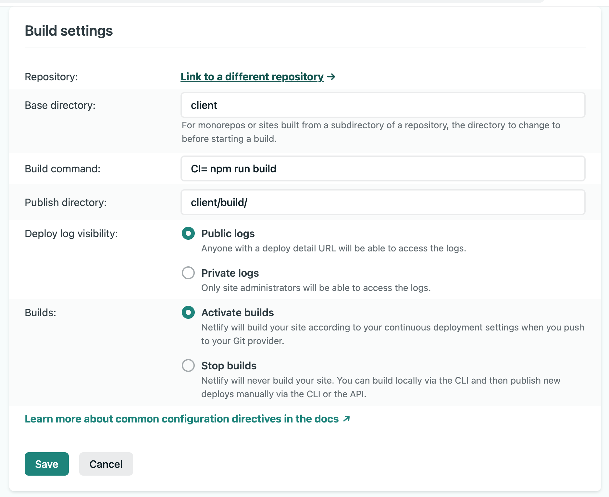
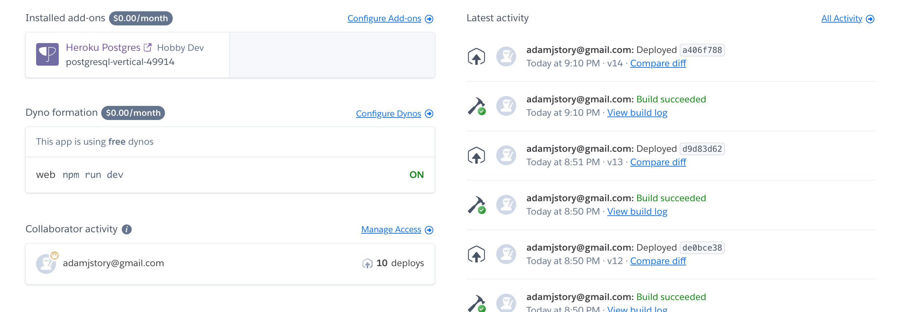

# Skeleton for React Node App

This skeleton is for quickly creating a full stack React Node App. The screenshots below show the intended deployment settings - the client (frontend) to be deployed on Netlify, and the server (backend) to be deployed on Heroku.

At this point in my coding journey, this would likely be to create a PERN (PostgresSQL, Express, React, Node) app.

